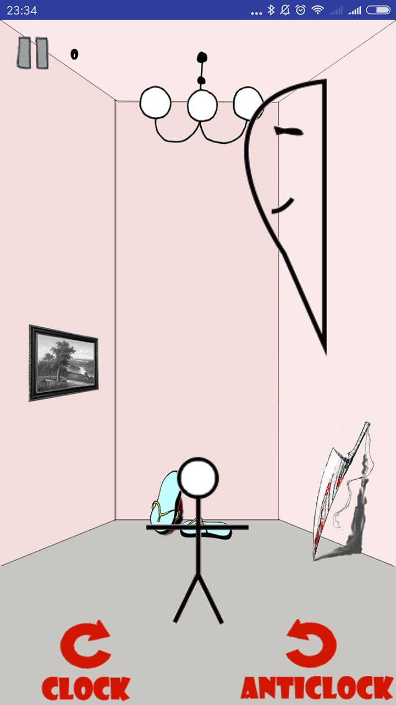

# StaringAtGhost

## Tree
  ├─APK 
  │      app-release.apk //程序安装包
  │ 
  ├─1412631-1511468-1511471StaringAtGhost.pdf //相关介绍文档
  │
  │
  ├─Logo&Psd //相关的logo以及psd文件
  │
  │
  ├─ScreenShot //应用截图
  │
  │
  └─SourceCode //源代码
    ├─Nodejs
    │	insertdata.js
    │	mysql.js
    │	showdata.js
    │      
    └─StaringAtGhost

##  成员
- 1412631 南健博 
- 1511468 杨茗凯 
- 1511471 詹明鑫 

## 应用平台下载链接
暂无

## 项目主要工作内容
利用一学期在移动平台开发的课程中所学的知识，实现一个在安卓客户端的小游戏，老少皆宜，休闲益智，并且在开发过程中逐步优化游戏体验。

## 应用简介
一个简单的火柴人，怎么才能抓到鬼呢？就是快速转动它的小脑袋，盯住突然出现在三面墙中的一只鬼怪，即可获得一分。游戏的难度会随着分数的增加而增加，用户可以选择将自己的分数上传到排行榜。

## 应用截图
- 主界面

- 游戏界面

- 排行榜界面

